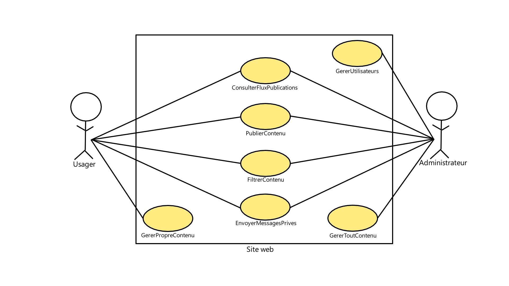

**Prénom Nom - Github - Discord**
-Xavier Van Winden - XaviervwETS - kitaupe
-Théo Houlachi - Yeosuwacos - yeosuwacos
-Ricardo Andres Ramirez Borjas - guarded0 - (underscore here)guarded
-Ares Gabrielyan - DrunkAxolotl - DrunkAxolotl
-Jeremy Chheang - Bobasaur001 - on_a_crocodile
-Loïc Beaudin-Kerzérho - LoicBeaudin - boxednyan
-Charles Lesage - ma17du32et422 - flqinc.1970

**Objectif Principal de l'Application**

Notre application a comme objectif principal d'être utilisé comme un centre du village virtuelle, surtout pour les étudiants d'université de la région métropolitaine de Montréal, où les gens peuvent discuter dans des forums, vendre et acheter dans un marché, etc.

**Choix Technologique pour l'Application**

Application Mobile Android
Web HTML, CSS, JavaScript, React
API Rest C#
Database ORACLE SQL

**Planification du Sprint 1**

**Diagramme de cas d'utilisation**

**Schéma initial de la base de données**

**Liste d'user stories**

ISSUES: https://github.com/ma17du32et422/TCH099/issues

**Liste de requis technologiques**

Pour publier et gérer des publications, il faut un API Rest en C# pour de la communication en ligne.
Pour envoyer des messages privés, il faut utiliser Websockets.
Pour les différencier les utilisateurs dont les administrateurs, il faut un système de compte en utilisant une base de données ORACLE SQL.
Pour faire un version mobile du forum, il faut utiliser Android Studio.

**Liste de requis non fonctionnels**
1.	Performances
  - Le temps de chargement visé pour le site est de moins de 2 sec pour la version web 
  -	Pour la version android nous nous référons aux guidelines de Android Dev https://developer.android.com/topic/performance/vitals/launch-time?hl=fr
  - Si l’ont se fie au traffic de r/etsmtl, nous auront un max de 8 000 utilisateurs par semaine
2.	Fiabilité
  -	Le site et la base de donnée serons sur deux serveurs pour avoir une disponibilité 24h et une récupération des données corrompues par un bris physique
3.	Sécurité
  - Pour protéger notre site nous allons utiliser https pour sécuriser les requêtes. 
  - L’authentification des requêtes sera sécurisé avec une clé d’API ou BEAR API 
  - La database sera sécurisé contre les injections sql et les mots de passes seront encryptés
4.	 Maintenance 
  -	Le code sera commenté et expliqué sur GitHub
  -	Le projet sera lié par l’Api rest pour que chaque partie soit indépendante et modulaire
  -	Il y a une version admin pour modérer facilement les publications
5.	Convivialité
  -	La règle des trois clics sera appliquée pour que les utilisateurs aient facilement accès aux fonctions
  -	L’interface des deux versions sera similaire pour que les utilisateurs n’aient pas à en apprendre deux.

